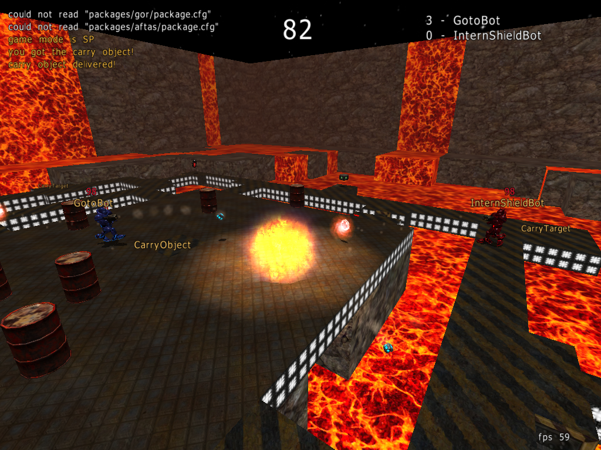

# ucla-pandemic-programming-contest
My submission and associated files for the 2009 UCLA Pandemic Programming Contest. Repo includes the context [rules and game files](UCLA-Pandemic%20Programming%20Contest.zip) and [my AI bot](GarrBot.cpp). The contest involved writing the AI for a bot running in the [Saurbraten](http://sauerbraten.org/) game engine and competing with other students in a bracket.

I did not win.

### How To Run

Running Visual Studio 15.2 (26430.15)
- In project properties > General
  - Set `Output Directory` to `../../Game/AIBots/`
- In project properties > Debugging
  - Set `Command` to `$(ProjectDir)../../Game/bin/sauerbraten.exe`
  - Set `Command Arguments` to `-t`
  - Set `Working Directory` to `$(ProjectDir)../../Game`
- Click `Local Windows Debugger`

TODO: Verify
